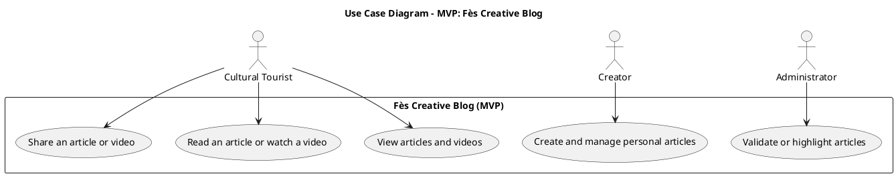

## 🕌 Context — *Updated for Creator as Article Author*

🎯 **1. Project Context**
Collaborative blog dedicated to connecting **traditional craftsmanship** and **modern innovations** in **Fès**.
Objective: showcase the city’s artisanal heritage, highlight creative modern projects, and connect **tourists, artisans, and young creators** through cultural and digital storytelling.

---

🎨 **2. Style & Design**
Style: elegant, cultural, and modern — a bridge between **heritage and innovation** 🧵💡
Colors: **gold (#d4af37)**, **dark blue (#0b132b)**, **beige**, and **white**
Layout: clean grid, full-width hero section, cultural visual identity (patterns, calligraphy accents)
Look & Feel: magazine / creative blog / cultural hub
Framework: **Tailwind CSS (via CDN)** + soft animations

---

🧱 **3. Pages to Include**

**Public Area:**

* Home
* Articles / Videos
* Article Detail

**Creator Area:**

* Create & Manage Personal Articles

**Admin Area:**

* Review / Validate Submitted Articles (simulation only)

---

📌 **4. Main Sections**

| Section             | Description                                                                   |
| ------------------- | ----------------------------------------------------------------------------- |
| Header + Navigation | Logo “Fès Creative Blog” + menu (Home, Explore, About, Creator, Admin)        |
| Hero Section        | Background photo of Fès Medina with slogan “Where Tradition Meets Innovation” |
| Article Grid        | Display latest posts (title, image, short text)                               |
| Featured Creators   | Highlight young artisans or creators with photo + tagline                     |
| Footer              | Contact, social media links, short description                                |

---

🧑‍🤝‍🧑 **5. User Experience**

* Full responsive (mobile / tablet / desktop)
* Simple navigation between pages
* Smooth transitions and hover effects
* Each article has “Read More” → leads to detail page
* Article page includes: title, media (image/video), description, and share buttons
* Creator page: simple mockup form to **add or edit articles** (stored locally or via JSON simulation)
* Admin page: view or validate submitted articles (simulation only)

---

⚙️ **6. Technologies**

* **HTML + Tailwind CSS (CDN only)**
* **Vanilla JavaScript** (for reading query params, simulating CRUD, etc.)
* No frameworks or build tools
* **FontAwesome icons** for share, edit, delete, etc.

---

✍️ **7. Expected Format**

* Clean and commented HTML + CSS
* Fully responsive
* Structure:

  * `index.html` → Home
  * `article.html` → Article Detail
  * `creator.html` → Create & Manage Articles
  * `admin.html` → Review / Validate Articles
  * Optional: `style.css` for minor custom styles

---

📊 **8. Use Case Diagram — MVP: Fès Creative Blog (Updated)**

---

🗂️ **9. Site Map — Blog “Fès Creative Blog” (Updated)**

### 🌍 Public Space

| Page              | Description                                                   |
| ----------------- | ------------------------------------------------------------- |
| Home              | Landing page featuring latest articles and videos             |
| Articles / Videos | Grid view with filters (heritage, design, innovation)         |
| Article Detail    | Full article with title, image, description, and share button |
| About (optional)  | Vision, mission, and story of the blog                        |

### 🧑‍🎨 Creator Space

| Page          | Description                                      |
| ------------- | ------------------------------------------------ |
| Creator Panel | Create, edit, or delete personal articles (mock) |

### 🔐 Admin Space

| Page            | Description                                        |
| --------------- | -------------------------------------------------- |
| Admin Dashboard | Review or validate submitted articles (simulation) |

---

🛠️ **10. Key Features**

✅ View and read articles
✅ Share article link
✅ **Creator adds and manages own content**
✅ **Admin validates and highlights posts**
✅ Responsive Tailwind design
✅ Elegant cultural theme blending tradition and innovation

---

📌 **Summary of Roles:**

| Role                  | Description                               | Permissions                |
| --------------------- | ----------------------------------------- | -------------------------- |
| **Tourist (Visitor)** | Reads & shares content                    | View / Share               |
| **Creator**           | Writes and manages articles               | Create / Edit / Delete own |
| **Admin**             | Validates, highlights, or removes content | Moderate / Review          |

---

🌈 Would you like me to **add the color palette & typography recommendations** (Arabic-inspired + modern sans-serif mix) to make the design guidelines fully complete for the next design step?
